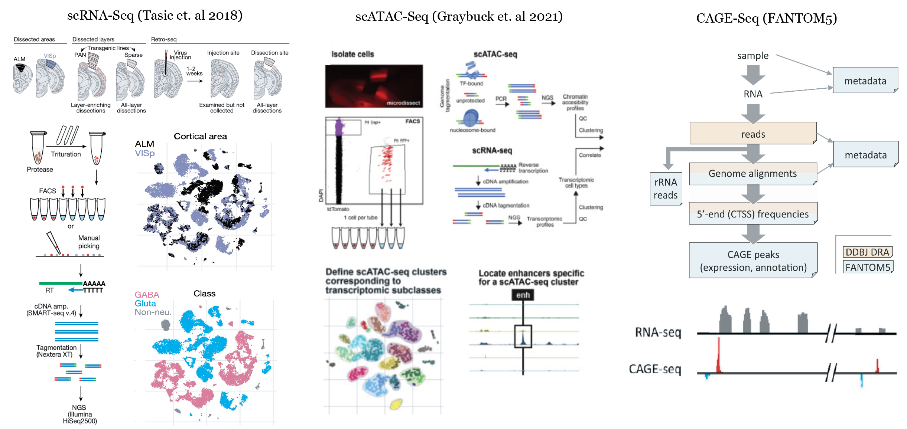

 

We provide access to processed and analyzed data of mouse single cell, primary cell and whole tissue originating from large studies (**scRNA-Seq** and **scATAC-Seq**) conducted in **Allen Institute for Brain Science** as well as additional projects such as **FANTOM5** for **CAGE-Seq**. This project has been conducted in collaboration with [Sena-Esteves Lab](https://www.umassmed.edu/gtc/about/faculty-publications/miguel-sena-esteves/) and [Bioinformatics Core](https://www.umassmed.edu/biocore/) at UMass Chan Medical School. 

In collaboration with [Sena-Esteves Lab](https://www.umassmed.edu/gtc/about/faculty-publications/miguel-sena-esteves/) and [Bioinformatics Core](https://www.umassmed.edu/biocore/) at UMass Chan Medical School, this website hosts two publicly accessible browsers for interactively visualizing genomic tracks and profiles of mouse brain cells.   

**UCSC Track Hub:** The scRNA-Seq, scATAC-Seq and CAGE-Seq reads are individually aligned using predefined pre-processing pipelines. Aligned reads are aggregated for cell types, tissues and regions of interests before transformed into BigWig files. To provide access to these aggregate single cell tracks we are hosting a custom [UCSC Track Hub](./ucscbrowser.html).

**Cellxgene Browser:** The scRNA data on mouse neocortex is analyzed using scRNA downstream analysis package called [Seurat](https://satijalab.org/seurat/). To provide access to the analyzed single cell data we are hosting an interactive browser based on [Cellxgene](./cellxgenebrowser.html).  

All raw sequencing data (scRNA-Seq, scATAC-Seq and CAGE-Seq) were processed by pipelines developed within the interactive pipeline manager [DolphinNext](./dolphinsuite.html) ([Yukselen et. al 2020](https://bmcgenomics.biomedcentral.com/articles/10.1186/s12864-020-6714-x)). Metadata as well as the processed datasets are currently being hosted in [DolphinSuite](./dolphinsuite.html), an end-to-end bioinformatics analysis platform.

##### **scRNA-Seq (Tasic et. al 2018):**

This study includes gene expression profiles of 3602 mouse neocortex single cells ([Tasic et. al 2018](https://www.nature.com/articles/s41586-018-0654-5)) that are collected from either anterior lateral motor cortex	(**ALM**) or primary visual cortex (**VISp**) of 360 mice donors whose ages are ranging between 51 and 91 days. Cells are isolated into individual wells using fluorescence-activated cell sorting (FACS) or manual picking. The cDNA libraries are generated and amplified using SMART-Seq. 

The paired sequencing reads of each individual cell are processed using the **scRNA-Seq (Tasic et al 2018)** pipeline that aligns and quantifies reads as previously described by ([Tasic et. al 2018](https://www.nature.com/articles/s41586-018-0654-5)). 

##### **scATAC-Seq (Graybuck et. al 2021):**

This study includes chromatin accessibility profiles of 3602 mouse cortex single cells ([Graybuck et. al 2021](https://www.sciencedirect.com/science/article/pii/S0896627321001598?via%3Dihub)) that are primarily collected from primary visual cortex (**VISp**) of 60 mice donors whose ages are ranging between 38 and 81 days. Cells are isolated into individual wells using fluorescence-activated cell sorting (FACS) or manual picking. The cDNA libraries are generated and amplified using SMART-Seq. 

The paired sequencing reads of each individual cell are processed using the **scATAC-Seq (Graybuck et al 2021)** pipeline that aligns and quantifies reads as previously described by ([Graybuck et. al 2021](https://www.sciencedirect.com/science/article/pii/S0896627321001598?via%3Dihub)). 

##### **CAGE-Seq (FANTOM5):**

[FANTOM5](https://fantom.gsc.riken.jp/5/) project incorporates CAGE sequencing reads from 1016 mouse samples. We have primarily aligned CAGE-Seq reads of **primary cells** (neuronal, astrocyte, microglia etc.) and **whole tissue** (cerebellum, visual cortex, hippocampus etc.) reads of mouse brain using a custom **CAGE-Seq ** pipeline. 
